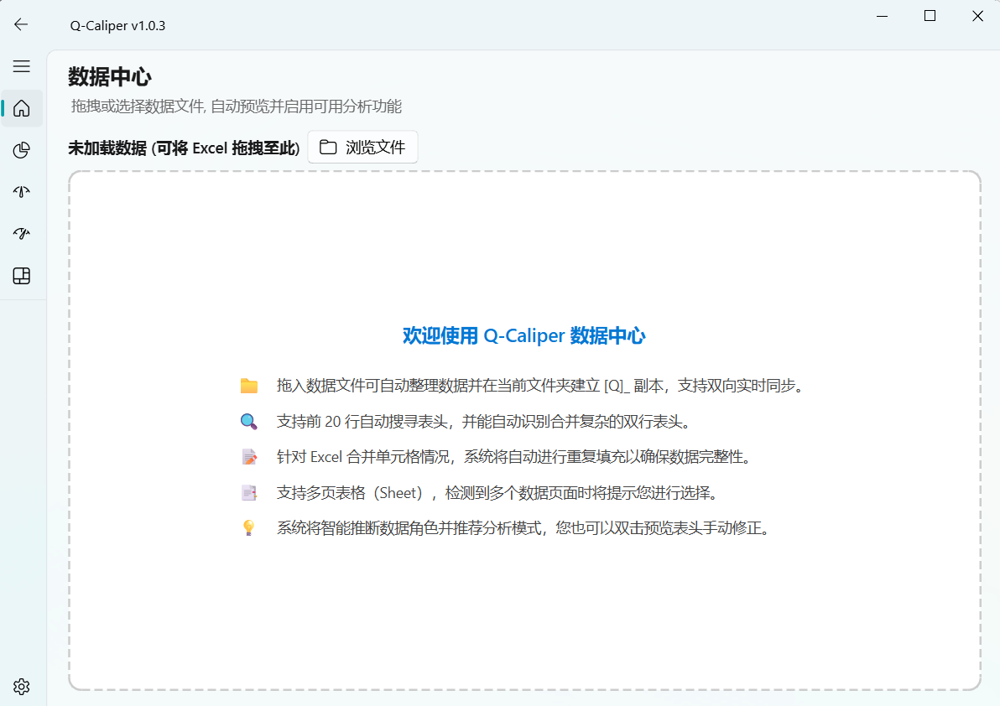

# Q-Caliper

> 由工程师为工程师设计的开源质量分析工具

## 定位

Q-Caliper 是一款面向质量工程师的开源桌面分析平台。我们坚持 **「Data-First」** 的设计理念：工程师通过简单的拖拽即可完成数据加载，系统将自动识别数据类型并点亮匹配的分析模块，配合先进的 Typst 引擎一键生成专业级、可追溯的 PDF 分析报告，实现质量分析流程的标准化与自动化。

## 核心功能与界面总览

Q-Caliper 提供基于 Fluent Design 的现代化用户界面，包含 7 个独立模块，全面覆盖质量工程的核心需求。



> **更多模块截图**：[过程能力分析](images/过程能力截图.png) | [量具分析 (GRR)](images/GRR截图.png) | [统计过程控制 (SPC)](images/过程控制截图.png) | [实验设计 (DOE)](images/试验设计截图.png)

| 模块类别 | 核心功能与界面说明 | 状态 |
|----------|---------|------|
| **数据中心** | **统一数据入口**：拖拽加载 Excel/CSV，自动推断数据角色，跨模块双向实时同步。 | ✅ 已完成 |
| **正态分析 (Capability)** | **Cpk/Ppk/Cmk 评估**：列映射 → 正态性检验 → 能力指数计算 → 直方图拟合与规格限评估。 | ✅ 已完成 |
| **量具分析 (MSA-GRR)** | **ANOVA 法 GRR**：方差分量计算，提供 6 图专业仪表板（箱线图/均值图/交互图/贡献率条形图等）。 | ✅ 已完成 |
| **MSA 分析** | **偏差与线性研究**：基于 t 检验的偏差分析，结合回归与 P/T 比的线性分析。 | ✅ 已完成 |
| **统计过程控制 (SPC)** | **控制图监控**：XBar-R / I-MR 绘制，自动标注 Nelson 八大判异准则，生成 Cpk 趋势及规格限推荐。 | ✅ 已完成 |
| **实验设计 (DOE)** | **快速矩阵生成**：全因子/部分因子设计，OLS 效应分析，一键绘制 Pareto 效应排序图。 | ✅ 已完成 |
| **设置与报告引擎** | **专业级 PDF 输出**：配置报告编制人等信息。基于底层 Typst 引擎一键生成排版精美的质量分析报告。 | ✅ 已完成 |

## 📊 算法准确度基准测试 (Benchmark)

为了验证 Q-Caliper 统计算法的准确性与可靠性，我们将 Q-Caliper 的计算结果与业界标杆软件（Minitab 17）进行了对比测试。详细测试报告（包含 Cpk/Ppk、GRR ANOVA 法、SPC 控制图）请查阅：

👉 [算法准确度基准测试报告 (Benchmark)](docs/Benchmark.md)

## 技术栈

| 类别 | 组件 | 说明 |
|------|------|------|
| 核心语言 | **Python 3.12+** | 类型注解完善，Nuitka 兼容 |
| UI 框架 | **PySide6 (Qt 6.x) + PySide6-Fluent-Widgets** | Win11 Fluent Design，深/浅色主题 |
| 打包编译 | **Nuitka** | 编译为 C++ 二进制 EXE（单文件分发） |
| 报告引擎 | **typst (Python 包)** | 原生 PDF 编译，无需 CLI |
| 数据处理 | **Pandas 2.x** | Excel/CSV 读写 |
| 统计推断 | **SciPy.stats** | 正态性检验、t 检验、F 检验 |
| 建模分析 | **Statsmodels** | OLS 回归、ANOVA |
| 实验设计 | **pyDOE2** | 全因子/部分因子设计矩阵 |
| 图形渲染 | **Matplotlib** | 嵌入 Qt 的图表引擎 |

## 快速开始

### 安装运行

```bash
git clone https://github.com/chenyu244/Q-Caliper.git
cd Q-Caliper

python -m venv .venv
.venv\Scripts\activate        # Windows
# source .venv/bin/activate   # Linux/macOS

pip install -r requirements.txt
python main.py
# 首次运行推荐在 data/examples/ 下载示例数据集试验
# 选择左侧导航的任意模块，拖拽 data/examples/*.xlsx 开始分析
```

### 打包为安装程序

```bash
# 1. Nuitka standalone 编译
python build.py
# 输出: dist/main.dist/ (多文件目录)

# 2. Inno Setup 打包为安装程序
# 安装 Inno Setup 6 (https://jrsoftware.org/isinfo.php)
# 右键 installer.iss -> Compile
# 输出: installer/Q-Caliper-1.0.0-Setup.exe
```

### 开发命令

```bash
ruff check .                  # 代码检查
mypy q_caliper/               # 类型检查
pytest                        # 运行单元测试
```

## 项目结构

核心设计遵循 **分层架构**：计算引擎（core/）独立于 UI，报告引擎（reports/）
可单独调用，便于集成或扩展。

```
Q-Caliper/
├── main.py                          # 应用入口
├── build.py                         # Nuitka 打包脚本 (standalone)
├── installer.iss                    # Inno Setup 安装包脚本
├── AGENTS.md                        # 开发铁律
├── pyproject.toml                   # 项目元数据
├── requirements.txt                 # 运行依赖
├── requirements-dev.txt             # 开发依赖
├── ruff.toml / mypy.ini / pytest.ini
│
├── q_caliper/
│   ├── core/                        # 核心计算引擎（无 UI 依赖）
│   │   ├── cpk.py                   #   Cpk/Ppk + 正态性检验
│   │   ├── grr.py                   #   GRR ANOVA + 数据验证
│   │   ├── msa.py                   #   偏差分析 + 线性分析
│   │   ├── spc.py                   #   控制图 + 八大判异准则
│   │   └── doe.py                   #   全因子/部分因子设计
│   │
│   ├── ui/                          # PySide6 + Fluent-Widgets 界面层
│   │   ├── main_window.py           #   主窗口 + 导航
│   │   ├── data_center.py           #   拖拽加载 + 数据预览
│   │   ├── cpk_panel.py             #   正态分析面板 + 直方图
│   │   ├── grr_panel.py             #   量具分析面板 + 6 图仪表板
│   │   ├── msa_panel.py             #   MSA 偏差/线性面板
│   │   ├── spc_panel.py             #   SPC 控制图面板
│   │   ├── doe_panel.py             #   DOE 实验设计面板
│   │   └── settings_panel.py        #   设置面板
│   │
│   ├── reports/                     # Typst 报告引擎
│   │   ├── report_engine.py         #   PDF 生成逻辑
│   │   └── templates/               #   .typ 模板文件
│   │       ├── template.typ         #   统一基础模板
│   │       ├── cpk_report.typ       #   正态分析报告
│   │       ├── grr_report.typ       #   量具分析报告
│   │       ├── msa_report.typ       #   MSA 分析报告
│   │       ├── spc_report.typ       #   SPC 分析报告
│   │       └── doe_report.typ       #   DOE 实验设计报告
│   │
│   └── tests/                       # 测试套件
│       ├── test_cpk.py
│       ├── test_grr.py
│       ├── test_msa.py
│       ├── test_spc.py
│       ├── test_doe.py
│       └── test_report.py
│
├── data/examples/                   # 示例数据集
│   ├── cpk_example.xlsx
│   ├── grr_example.xlsx
│   ├── msa_example.xlsx
│   ├── spc_example.xlsx
│   └── generate_samples.py
│
└── docs/                            # 文档
    ├── 使用说明.md
    ├── 函数功能清单.md
    ├── qcaliper_capability_guide.typ # 过程能力深度指南
    ├── qcaliper_msa_guide.typ        # MSA 分析深度指南
    ├── qcaliper_spc_guide.typ        # SPC 分析深度指南
    └── qcaliper_doe_guide.typ        # DOE 实验设计深度指南
```

## 示例数据

`data/examples/` 目录提供 4 套标准测试数据：

| 文件 | 分析模块 | 建议参数 |
|------|----------|----------|
| `cpk_example.xlsx` | 正态分析 | 测量列: 测量值, USL=60, LSL=40 |
| `grr_example.xlsx` | 量具分析 | 测量列: 测量值, 操作者列: 操作者, 零件列: 零件 |
| `msa_example.xlsx` | MSA 分析 | 偏差: 测量值(参考值=100), 线性: 参考值_线性 + 测量均值_线性 |
| `spc_example.xlsx` | SPC 分析 | 测量列: 测量值, USL=110, LSL=90 |

## 文档

- [使用说明](docs/使用说明.md) — 安装、各模块操作流程、FAQ
- [函数功能清单](docs/函数功能清单.md) — 核心 API、UI 类、报告引擎参考

## 🤝 支持项目

Q-Caliper 仍处于活跃开发阶段，如果你觉得它对你的工作有帮助：
- ⭐ **点亮 Star**：这是对开发者最大的鼓励。
- 📢 **分享建议**：推荐给同样深受统计分析困扰的同行。
- 💬 **反馈问题**：欢迎提交 [Issue](https://github.com/chenyu244/Q-Caliper/issues) 提供改进建议。

## 免责声明

本软件仅供学习、研究和内部参考使用。作者不对因使用本软件所产生的任何直接或间接损失承担责任。

- 本软件的算法实现参考了公开的质量工程文献和行业标准（如 AIAG MSA 手册、ASTM 标准等），但不保证与任何商业软件的计算结果完全一致。
- 使用本软件进行正式质量决策前，请务必由具备资质的质量工程师对结果进行独立验证。
- 本项目部分代码由 AI 辅助生成，已尽力确保正确性，但仍需人工审查。

## 许可证

[MIT License](LICENSE)
